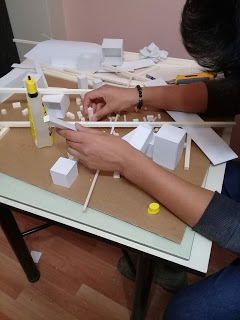
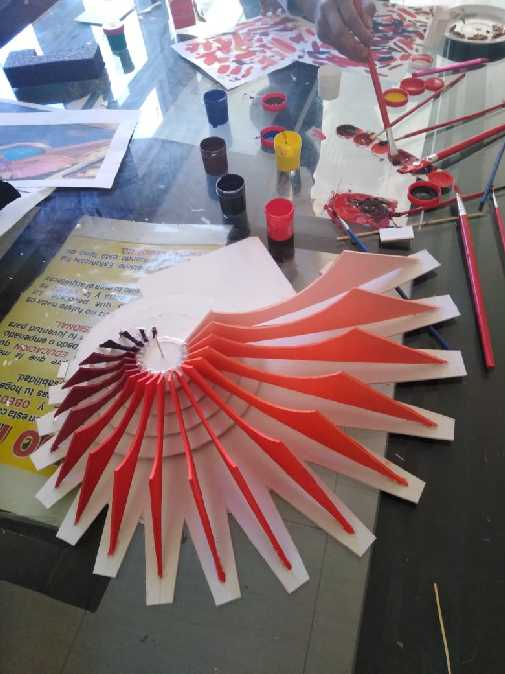
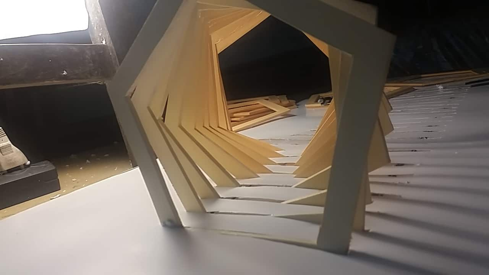

# Anexo {-}

{width=100% height=500}
{width=100% height=500}
{width=100% height=500}
{width=100% height=500}
{width=100% height=500}

Mas imagenes del proceso en detalle dirijase al blog <https://fismarte.blogspot.com/> 

