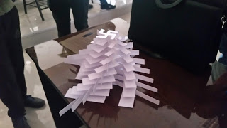
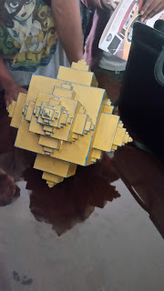
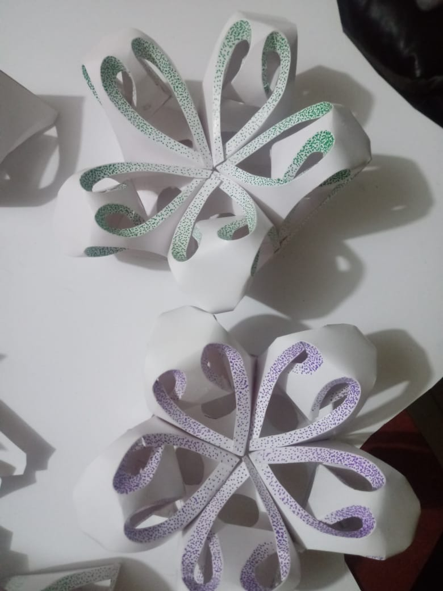
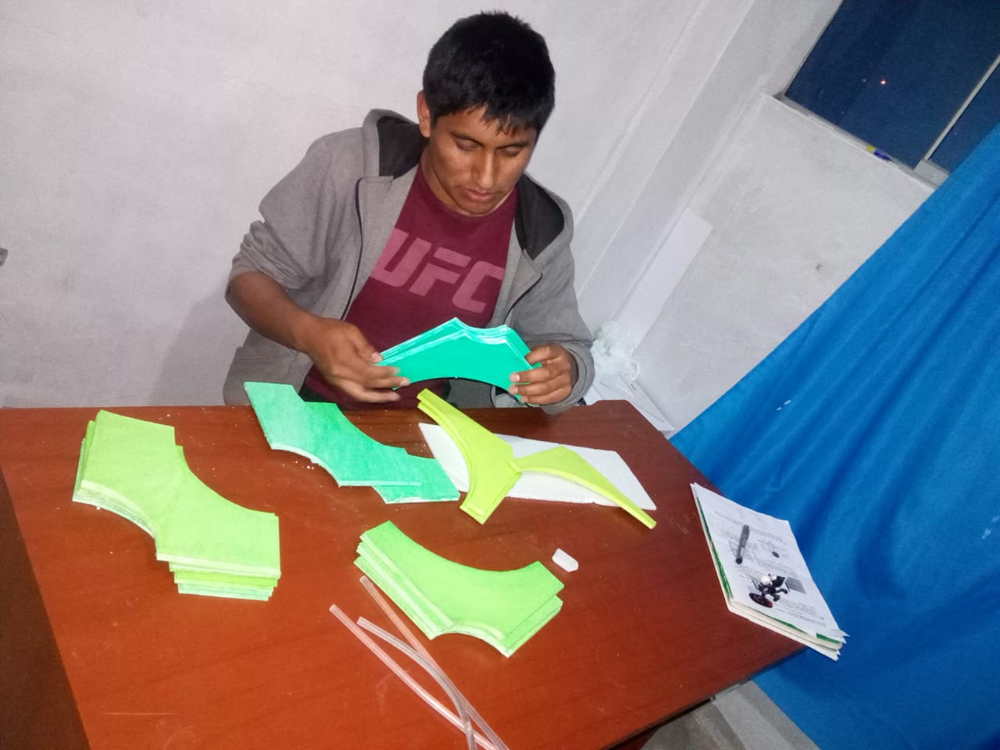

--- 
title: Geometría fractal en la composición plástica tridimensional de los
  estudiantes de la Escuela de Formación Profesional de Ingenieria Civil UNSCH 2019
author: "MALLQUI BAÑOS Ricardo Michel"
date: "`r Sys.Date()`"
output:
  pdf_document: default
  html_document: default
  word_document: default
urlcolor: blue
description: This is a minimal example of using the bookdown package to write a book.
  The output format for this example is bookdown::gitbook.
documentclass: report
fontsize: 12pt
link-citations: yes
bibliography:
- book.bib
- packages.bib
site: bookdown::bookdown_site
subparagraph: yes
biblio-style: apalike
---

<!--chapter:end:index.Rmd-->

# Problema de investigación


## Planteamiento del problema

Los artistas frecuentemente manipulan la *geometría fractal*, por lo menos intuitivamente,
para desarrollar sus creaciones artísticas, no obstante, se observa que no todos
utilizan la geometría fractal, en la realización de los trabajos artísticos plásticos, tendiendo
a ser más intuitivos; probablemente por falta de conocimiento acerca de la utilidad
de esta herramienta, el presente trabajo de investigación pretende concluir, que la utilización
de la *geometría fractal*, mejorará la *composición plástica tridimensional*, y por
tanto concluir que la geometría fractal es una herramienta primordial, en la estructuración
o distribución de los elementos plásticos de acuerdo a los *principios de la composición*
plástica tridimensional.

A nivel nacional se observa que el *uso de la geometría es muy superficial*. Se sabe
que ninguna ciencia o conocimiento técnico esta disociada de otras, Por lo tanto el proceso
de la creación plástica esta involucrado con muchas ramas del conocimiento humano,
en particular con las geometría que viene a ser la consecuencia racional de la ostentación
histórica asumido por la cultura occidental, inevitablemente ineludible por tanto es
necesario, optar por lo reflexivo del arte, que involucre un proceso sin condición.


A nivel regional se observa la tendencia del uso de la geometría fractal muy deficiente,
en algunas representación baga de un modelo. Se supone que el manejo de las
geometría, está conexa con el desarrollo creativo y la confección de trabajos plásticos
atractivos, por lo que es ineludible considerarla en los proyectos artísticos, para poder
evitar conflictos en el proceso artístico de componer esculturas, con elementos plásticos
distribuidos aleatoriamente.

En particular a nivel regional existen la Escuela de Formación Profesional de Ingeniería
Civil UNSCH – Ayacucho,x los docentes de arte tienen poco conocimiento sobre la
estructuración de los elementos plásticos. Se considera organizar un criterio pedagógico
en base a teorías prácticas y establecidas, que son ineludibles en la creación plástica, lo
cual ya existe implícitamente, pero de manera muy exigua, de esta manera la creatividad
fluye eficientemente, es decir, no depender de formas pilotos a copiar, sin discernir sobre
que leyes gobiernan a tales modelos. El objetivo es deducir esas leyes, coleccionarlas
en artículos y emplearlos en trabajos artísticos posteriores y teorizar infinitas nociones
estructurales de aquellos modelos, de este modo las pruebas casuales de componer los
fragmentos con el todo, se simplifica.


El problema admite investigar la extensión geometría fractal en la reproducción de
esculturas mucho más eficientes, compositiva y expresivamente, y si resultara, esta
extensión intervenga en la creación de nuevos cursos recíprocos al contenido de este
proyecto, en las entidades concernientes al arte en general: Música, Teatro, Danza y Artes
Plásticas (Dibujo, Pintura, Escultura y Grabado). Los fractales por si solos ya son una
obra de arte, porque los elementos que lo forman se asocian secuencialmente formando
un todo integral, y atractivo a lo percepción visual.


La separación de ciertos componentes artísticos entre estos la matemática en la creación
artística plástica, implica la falta de creatividad, sensibilidad e identificación plástica
en los educandos, con sus trabajos. Se asume sobre la comprensión probable de algún prototipo
de geometría acreditado por nuestros ancestros, justificados en vestigios dejados
por ellos, pero no se alcanzó a teorizar, esta es la brecha para condicionar una identidad
formativa. Paradójicamente preexiste una predisposición a evaluar poco y no registrar lo
experimentado, lo cual formarían fragmentos en la organización de una idea en particular.

Del mismo modo, algunos artistas, por su formación habitual posiblemente excluyen
ciertos conceptos determinados, entre ellas las secuencias, para desarrollar la creatividad,
plasticidad y caracterización artística. Indistintamente, las escasas asignaturas artísticas
que se establecen en la institución, no ilustran sus competencias como correspondería
ser. Lo cual se puede relacionar, de manera sospechada, de los clamores estudiantiles,
hacia los componentes defectuosos en la didáctica y la deserción de algunos con muchas
competencias artísticas de las escuelas de arte, por lo poco permisoras que estas son, en
la promoción laboral y cultural.

En consecuencia es necesario, generar pluralidad epistemológica novedosa, auténtica
y trascendente, para determinar el proceso intelectual y creativo mediante el tratamiento
de investigaciones sólidas, es decir empezar a formar disposiciones de enseñanza mucho
más sistemáticas, de manera que, el estudiante se involucre naturalmente con las artes
plásticas, en la Escuela de Formación Profesional de Ingeniería Civil UNSCH – Ayacucho,
y realice una carrera prometedora, conveniente, con el objetivo de un beneficio
social y particular. Promoviendo el uso de la geometría fractal en las creaciones artísticas
en las diferentes instituciones y especialidades.

## Formulación del problema

### Problema General
¿En que medida la aplicación de la geometría fractal influye en la composición plástica
tridimensional de los estudiantes de la Escuela de Formación Profesional de Ingenieria
Civil UNSCH 2019?.

### Problemas Específicos

1. ¿De qué manera la aplicación de la geometría fractal mejorará la variedad en el
composición plástica tridimensional de los estudiantes?.
2. ¿De qué manera la aplicación de la geometría fractal mejorará la unidad en composición
plástica tridimensional de los estudiantes?.

3. ¿De qué manera la aplicación de la geometría fractal mejorará el ritmo en la composición
plástica tridimensional de los estudiantes?.

4. ¿De qué manera la aplicación de la geometría fractal desarrollará el equilibrio en
la composición plástica tridimensional de los estudiantes?.

5. ¿De qué manera la aplicación de la geometría fractal desarrollará el énfasis en la
composición plástica tridimensional de los estudiantes?.

## Justificación

Las justificaciones sobre el porque del presente trabajo de investigación, se describen
en cinco categorías, todas ellas señalando la importancia especifica.

### Justificación artística

El presente trabajo de investigación se realiza debido a la necesidad promover la utilización
de la geometría fractal en la composición plástica tridimensional con el objetivo
de generar trabajos artísticos de acuerdo a los principios compositivos, es decir un trabajo
artístico muy bien estructurado.

### Justificación educativa

El objetivo de la investigación en el aspecto educativo es la de implementar esta práctica
de reproducción plástica, en los planes de estudios, y hacerle ineludible, su uso por
parte de los estudiantes, generando trabajos artísticos, estructuralmente agradables.
## Justificación Legal
Los estatutos presentes en la constitución política, que aprueban la ejecución del presente
trabajo de investigación; las cuales avalan el proceso investigativo artístico; son la
siguientes:

El artículo 2, expresa que toda persona tiene derecho a la libertad de creación intelectual, artística, técnica y científica, así como a la propiedad sobre dichas creaciones y a
su producto. El Estado propicia el acceso a la cultura y fomenta su desarrollo y difusión.
El articulo 18 avala que la educación universitaria tiene como fines la formación profesional,
la difusión cultural, la creación intelectual y artística y la investigación científica
y tecnológica. El Estado garantiza la libertad de cátedra y rechaza la intolerancia.

## Limitación

Los obstáculos que se encontraron en la realización del trabajo fueron, los escasos
referentes bibliográficos sobre todo de los antecedentes de la investigación. Además de
la accesibilidad a una cantidad mayor de muestra. No hubo apoyo alguno por parte de
las instituciones de educación artística. La disponibilidad de tiempo suficiente y la deficiencia
de algunos recursos necesarios en la aplicación de este recursos de producción
plástica.

## Antecedentes

### Internacionales

Larrea (2017) en su trabajo de investigación titulado «Elementos de la geometría
fractal como estrategia didáctica para el desarrollo del pensamiento geométrico en estudiantes
de la media básica del C.E. bachillerato en bienestar rural sede Ciato en el
municipio de Pueblo Rico mediante elementos de la naturaleza»


Lyra (2008) «Intercomunicación entre matemáticas - ciencia - arte: un estudio sobre
las implicaciones de las geometrías en la producción artística desde el gótico hasta el
surrealismo»

Castellanos (2017) «La geometría fractal en la licenciatura de diseño gráfico: propuesta
pedagógica centrada ene un entorno computacional»


### Nacionales

Larrea Hernández (2019) en su tesis «La cerámica como medio de expresión en el
arte contemporáneo»

Lazo Pinto (2017) en su tesis «El valor simbólico del numero – idea en la ordenación
de las figuras en el Obelisco Tello»

Anticona (2018) en su tesis «El desnudo en el arte mochica»

### Regionales
Parado y Lopez (2000) con la monografía «Formas de expresión y representación
gráfica en niños de 7-13 años de edad de la escuela estatal N 36053 MX-P de «Barrios
Altos» – Ayacucho»


Cruz, Huaripoma y Luya (2002) en la monografía «La composición artística en el diseño
gráfico computarizado en la escuela superior de Bellas Artes «Felipe Guamán Poma de
Ayala» Ayacucho – 2002»

Galvez, Toledo y Vasquez (2005) en la monografía «Uso adecuado del material didáctico
(Torneta) en el aprendizaje en el taller de la Escuela Superior de Bellas Artes
«Felipe Guamán Poma de Ayala» – 2004»

## Objetivos
### Objetivo general
*Determinar* las influencias de la *aplicación* de la *geometría fractal* en la **composición
plástica tridimensional** de los estudiantes de la Escuela de Formación Profesional de
Ingenieria Civil UNSCH 2019.

### Objetivos específicos

1. *Justificar* la mejora que genera la *aplicación* de la *geometría fractal* en la **variedad**
en la composición plástica tridimensional de los estudiantes.

2. *Analizar* la mejora que genera la aplicación de la *geometría fractal* en la **unidad** en
la composición plástica tridimensional de los estudiantes.

3. *Verificar* los incrementos que genera la *aplicación* de la *geometría fractal* en el
**ritmo** en la composición plástica tridimensional de los estudiantes.

4. *Confirmar* el desarrollo que genera la *aplicación* de la *geometría fractal* en el **equilibrio**
de composición plástica tridimensional de los estudiantes.

5. *Constatar* el desarrollo que genera la *aplicación* de la geometría fractal en el **énfasis**
de composición plástica tridimensional de los estudiantes. 


<!--chapter:end:02-planteamiento.Rmd-->

# Marco teórico


## Contexto de la investigación

La Escuela de Formación Profesional de Ingeniería Civil UNSCH – Ayacucho destinada a
desarrollar la capacidad intelectual, moral y afectiva de las personas de acuerdo con la cultura
y las normas de convivencia de la sociedad a la que pertenecen en particular con respecto al
arte que es toda forma de expresión de carácter creativo que puede tener un ser humano. Se
trata de expresar lo que una persona siente a través de una infinidad de formas y técnicas, y
promover en los educandos estas practicas.

## Geometría fractal

Un fractal es un **ente gráfico** *cuya organización básica, fraccionada, se repite a distintas
escalas*. La expresión fue planteada por el matemático Benoit Mandelbrot en los 70. Diversas
organizaciones naturales son de prototipo fractal. 

La característica matemática de un objeto verdaderamente fractal es que su dimensión fractal es un número no entero si el objeto vive
en el espacio bidimensional entonces su dimensión oscilará entre 0 y 2 y si vive en el espacio
tridimensional tendrá una dimensión comprendido entre 2 y 3 pero nunca estos números
enteros.

1. **La Fractales naturales**

2. **La Fractales abstractos**

## Composición plástica tridimensional

Las **principios** que se deben seguir, con el objetivo de obtener un trabajo artístico agradable se
conocen como los **principios de la composición**, las cuales son: *Equilibrio, variedad, unidad,
proporción, ritmo, simetría, armonía, balance, movimiento, repetición, énfasis, punto focal*.

En esta investigación solo se consideran **cinco** de las mas importantes de acuerdo al criterio
del investigador, además de considerar la similitud de sus conceptos. Es decir se consideran
el equilibrio (proporción, balance, simetría), la variedad (patrones, repetición, recursividad)
la unidad (armonía, conjunción) el énfasis (punto focal) y el ritmo (movimiento).

1. **Variedad**
2. **Unidad**
3. **Ritmo**
4. **Equilibrio**
5. **Énfasis**


<!--chapter:end:04-teorico.Rmd-->

# Metodología


## Hipótesis

### Hipótesis principal

La aplicación de la geometría fractal influye significativamente en el desarrollo de
la composición plástica tridimensional de los estudiantes de la Escuela de Formación
Profesional de Ingenieria Civil UNSCH 2019.

### Hipótesis específicas

1. La aplicación de la geometría fractal mejora significativamente la variedad en la
composición plástica tridimensional de los estudiantes.

2. La aplicación de la geometría fractal mejora positivamente la unidad en la composición
plástica tridimensional de los estudiantes.

3. La aplicación de la geometría fractal mejora significantemente el ritmo en la composición
plástica tridimensional de los estudiantes.

4. La aplicación de la geometría fractal desarrolla significativamente el equilibrio en
la composición plástica tridimensional tridimensional de los estudiantes.

5. La aplicación de la geometría fractal desarrolla significativamente el énfasis en la
composición plástica tridimensional tridimensional de los estudiantes

## Variables

## Operacionalización de variables
### Definición conceptual de variables

1. **Variable Independiente** (Geometría fractal)
2. **Variable Dependiente** (Composición plástica tridimensional)
3. **Variable Interviniente** (Aptitud artística y contexto social)

### Operacionalización de variables

1. **Geometría fractal:** Modelo
alternativo que busca una regularidad en las relaciones entre un objeto y sus
partes a diferentes escalas. 
2. **Composición plástica tridimensional:** Constituida por reglas y principios que modela con los elementos plásticos.

## Metodología

### Tipo de estudio

La investigación es de tipo explicativa experimental, porque se busca la causa y efecto
en cada una de las variables de estudio, con manipulación de la variable independiente

### Diseño

El diseño de la investigación es preexperimental de un mismo grupo de trabajo con pre y
posprueba, porque se tomó un solo grupo experimental.

## Métodos de investigación

1. Método experimental
1. Método hipotético deductivo
1. Método analítico
1. Método estadístico

## Población y muestra

* **Población**: 1080 estudiantes de la EF IC matriculados en el ciclo impar 2019
* **Muestra**: 1080 estudiantes de la *serie 200*, en la EF IC matriculados en el ciclo impar 2019
* **Muestreo**: No probabilístico e intencional

## Técnicas e instrumentos de recolección de datos 

### Técnicas 
1. La observación
2. Experimentación
2. Prueba escrita

### Instrumentos 

1. La ficha de observación 

2. La lista de cotejo 

3. Prueba escrita 

4.  Ficha de opinión

#### Módulos de experimentación


1. Los fractales naturales

2. Fractales abstractos

3. Fractales 

### Validación y confiabilidad de instrumentos

#### Validación de instrumentos

Juicio de expertos

Expertos | Validación | Situación
:--:|:--:|:--:
Mg. Marcelino Efraín Taipe Carbajal | 0,8 | Aceptable |
Dr. Pedro Huauya Quispe | 0,84 | Aceptable |
Mg. Juarez Pulache José Pulache  | 0,84 | Aceptable |
Promedio | 0,83 (83 %) | Aceptable |


#### Confiabilidad de instrumentos

mediante el Coeficiente de Pearson
y la corrección de Spearman Brow

Instrumentos | Coeficiente | Interpretación
|:--:|:--:|:--:
Ficha de observación (variable independiente) | 0.97 | Elevada
Ficha de observación (variable independiente) | 1 | Elevada 
Ficha de opinión  | 0.82| Aceptable
PROMEDIO | 0.93 (93 %) | Elevada

## Métodos de análisis de datos 


1. **Análisis descriptivo: ** Medidas de tendencia central, dispersión y asimetría
1. **Análisis inferencial:** Shapiro Wilks, Levene y T student

<!--chapter:end:05-metodologico.Rmd-->

# Resultados de la investigación


## Descriptivos
### Descriptivo opinión

```{r, echo=FALSE, results="asis",message = FALSE, warning = FALSE}
library(openxlsx) 
wwt <- read.xlsx(xlsxFile="levene.xlsx",sheet=10,cols=c(4,10,14,15),rows=c(2:37),colNames=TRUE)
```


```{r, echo=FALSE, results="asis",message = FALSE, warning = FALSE, fig.height = 3, fig.align = 'center'}
par(mfrow=c(1,4)) 
q1<-barplot(table(wwt$O1), main="Motivador", freq = TRUE, names.arg=c("No", "A veces", "Si"), cex.names=0.8)
text(q1, table(wwt$O1)-2, labels = table(wwt$O1), pos = 3, cex = .75)
q2<-barplot(table(wwt$O2), main="Formativa", freq = TRUE, names.arg=c("No", "A veces", "Si"), cex.names=0.8)
text(q2, table(wwt$O2)-2, labels = table(wwt$O2), pos = 3, cex = .75)
q3<-barplot(table(wwt$O3), main="Reforzador", freq = TRUE, names.arg=c("No", "A veces", "Si"), cex.names=0.8)
text(q3, table(wwt$O3)-2, labels = table(wwt$O3), pos = 3, cex = .75)
q<-barplot(table(wwt$O), main="Opinión", freq = TRUE, names.arg=c("No", "A veces", "Si"), cex.names=0.8)
text(q, table(wwt$O)-2, labels = table(wwt$O), pos = 3, cex = .75)
```

### Descriptivo (VI)

```{r, echo=FALSE, results="asis",message = FALSE, warning = FALSE}
library(openxlsx)
w2 <- read.xlsx(xlsxFile="levene.xlsx",sheet=4,cols=c(10,20,21),rows=c(2:37),colNames=FALSE)

```

```{r, echo=FALSE, results="markup",message = FALSE, warning = FALSE, fig.height = 3,  fig.align = 'center'}
library(fdth)
dist <- fdt(w2$X1, start=0, end=20, h=5,right = TRUE)
dist1 <- fdt(w2$X2, start=0, end=20, h=5,right = TRUE)
dist2 <- fdt(w2$X3, start=0, end=20, h=5,right = TRUE)
options("digits" = 2)
dist
dist1
dist2


#attach(mtcars)
par(mfrow=c(1,3)) 
intervalos <- seq(from = 0, to = 20, by = 5) 
h <- hist(w2$X1, 
          breaks = intervalos,  # Añadimos los intervalos
          freq = TRUE, # Representa frecuencias
          right = TRUE, # Intervalos [a, b). Por defecto: (a, b]
          col = rgb(79, 129, 189, max = 255), # Color de las columnas
          border = "white",     # Color del borde 
          labels = TRUE,        # Etiquetas de las columnas
          main = "NATURALES", # Título del gráfico
          xaxt = "n",           # Eliminamos eje x
          yaxt = "n",           # Eliminamos eje y
          xlab = "Notas",        # Título del eje x
          ylab = NULL,          # Título del eje y
          ylim = c(0,34))      # Escala de y (fijamos max en 20)
axis(side = 1, at = intervalos)  # Etiquetas del eje x 
h <- hist(w2$X2, 
          breaks = intervalos,freq = TRUE,right = TRUE,col = rgb(79, 129, 189, max = 255),border = "white",labels = TRUE,  main = "ABSTRACTOS", xaxt = "n", yaxt = "n", xlab = "Notas",ylab = NULL,ylim = c(0, 39)) 
axis(side = 1, at = intervalos)
h <- hist(w2$X3, 
          breaks = intervalos,freq = TRUE,right = TRUE,col = rgb(79, 129, 189, max = 255),border = "white",labels = TRUE,  main = "FRACTALES", xaxt = "n", yaxt = "n", xlab = "Notas",ylab = NULL,ylim = c(0, 39)) 
axis(side = 1, at = intervalos)
```


### Descriptivo (VD)

```{r, echo=FALSE, results="asis",message = FALSE, warning = FALSE}
library(openxlsx)
y1 <- read.xlsx(xlsxFile="levene.xlsx",sheet=8,cols=c(1,2),rows=c(1:36),colNames=TRUE)
y2 <- read.xlsx(xlsxFile="levene.xlsx",sheet=8,cols=c(3,4),rows=c(1:36),colNames=TRUE)
y3 <- read.xlsx(xlsxFile="levene.xlsx",sheet=8,cols=c(5,6),rows=c(1:36),colNames=TRUE)
y4 <- read.xlsx(xlsxFile="levene.xlsx",sheet=8,cols=c(7,8),rows=c(1:36),colNames=TRUE)
y5 <- read.xlsx(xlsxFile="levene.xlsx",sheet=8,cols=c(9,10),rows=c(1:36),colNames=TRUE)
y6 <- read.xlsx(xlsxFile="levene.xlsx",sheet=8,cols=c(11,12),rows=c(1:36),colNames=TRUE)
```

#### Variedad

```{r, echo=FALSE, results="markup",message = FALSE, warning = FALSE, fig.height = 3, fig.align = 'center'}
library(fdth)
dist_1 <- fdt(y1$TRADICIONAL, start=0, end=20, h=5,right = TRUE, digits = 2)
distt_1 <- fdt(y1$EXPERIMENTAL, start=0, end=20, h=5,right = TRUE, digits = 3)
options("digits" = 2)
library("knitr")
dist_1$table
distt_1$table

par(mfrow=c(1,3)) 
hist(y1$TRADICIONAL, 
          breaks = intervalos,freq = TRUE,right = TRUE,col = rgb(79, 129, 189, max = 255),border = "white",labels = TRUE,  main = "TRADICIONAL", xaxt = "n", yaxt = "n", xlab = "Notas",ylab = NULL,ylim = c(0, 31)) 
axis(side = 1, at = intervalos)

hist(y1$EXPERIMENTAL, 
          breaks = intervalos,freq = TRUE,right = TRUE,col = rgb(79, 129, 189, max = 255),border = "white",labels = TRUE,  main = "EXPERIMENTAL", xaxt = "n", yaxt = "n", xlab = "Notas",ylab = NULL,ylim = c(0, 31)) 
axis(side = 1, at = intervalos)

boxplot(y1$TRADICIONAL,y1$EXPERIMENTAL)
medias <- c(mean(y1$TRADICIONAL),mean(y2$EXPERIMENTAL))
points(medias,pch=16,col="blue")
```
```{r, echo=FALSE,results='markup', fig.align = 'center'}
summary(y1)
```

#### Unidad


```{r, echo=FALSE, results="markup",message = FALSE, warning = FALSE, fig.height = 3, fig.align = 'center'}
library(fdth)
dist_1 <- fdt(y2$TRADICIONAL, start=0, end=20, h=5,right = TRUE, digits = 2)
distt_1 <- fdt(y2$EXPERIMENTAL, start=0, end=20, h=5,right = TRUE, digits = 3)
options("digits" = 2)
library("knitr")
dist_1$table
distt_1$table

par(mfrow=c(1,3)) 
hist(y2$TRADICIONAL, 
          breaks = intervalos,freq = TRUE,right = TRUE,col = rgb(79, 129, 189, max = 255),border = "white",labels = TRUE,  main = "TRADICIONAL", xaxt = "n", yaxt = "n", xlab = "Notas",ylab = NULL,ylim = c(0, 31)) 
axis(side = 1, at = intervalos)

hist(y2$EXPERIMENTAL, 
          breaks = intervalos,freq = TRUE,right = TRUE,col = rgb(79, 129, 189, max = 255),border = "white",labels = TRUE,  main = "EXPERIMENTAL", xaxt = "n", yaxt = "n", xlab = "Notas",ylab = NULL,ylim = c(0, 31)) 
axis(side = 1, at = intervalos)

boxplot(y2$TRADICIONAL,y2$EXPERIMENTAL)
medias <- c(mean(y2$TRADICIONAL),mean(y2$EXPERIMENTAL))
points(medias,pch=16,col="blue")
```

```{r, echo=FALSE,results='markup', fig.align = 'center'}
summary(y2)
```

#### Ritmo 

```{r, echo=FALSE, results="markup",message = FALSE, warning = FALSE, fig.height = 3, fig.align = 'center'}
library(fdth)
dist_1 <- fdt(y3$TRADICIONAL, start=0, end=20, h=5,right = TRUE, digits = 2)
distt_1 <- fdt(y3$EXPERIMENTAL, start=0, end=20, h=5,right = TRUE, digits = 3)
options("digits" = 2)
library("knitr")
dist_1$table
distt_1$table

par(mfrow=c(1,3)) 
hist(y3$TRADICIONAL, 
          breaks = intervalos,freq = TRUE,right = TRUE,col = rgb(79, 129, 189, max = 255),border = "white",labels = TRUE,  main = "TRADICIONAL", xaxt = "n", yaxt = "n", xlab = "Notas",ylab = NULL,ylim = c(0, 31)) 
axis(side = 1, at = intervalos)

hist(y3$EXPERIMENTAL, 
          breaks = intervalos,freq = TRUE,right = TRUE,col = rgb(79, 129, 189, max = 255),border = "white",labels = TRUE,  main = "EXPERIMENTAL", xaxt = "n", yaxt = "n", xlab = "Notas",ylab = NULL,ylim = c(0, 31)) 
axis(side = 1, at = intervalos)

boxplot(y3$TRADICIONAL,y3$EXPERIMENTAL)
medias <- c(mean(y3$TRADICIONAL),mean(y2$EXPERIMENTAL))
points(medias,pch=16,col="blue")
```
```{r, echo=FALSE,results='markup', fig.align = 'center'}
summary(y3)
```
#### Equilibrio

```{r, echo=FALSE, results="markup",message = FALSE, warning = FALSE, fig.height = 3, fig.align = 'center'}
library(fdth)
dist_1 <- fdt(y4$TRADICIONAL, start=0, end=20, h=5,right = TRUE, digits = 2)
distt_1 <- fdt(y4$EXPERIMENTAL, start=0, end=20, h=5,right = TRUE, digits = 3)
options("digits" = 2)
library("knitr")
dist_1$table
distt_1$table

par(mfrow=c(1,3)) 
hist(y4$TRADICIONAL, 
          breaks = intervalos,freq = TRUE,right = TRUE,col = rgb(79, 129, 189, max = 255),border = "white",labels = TRUE,  main = "TRADICIONAL", xaxt = "n", yaxt = "n", xlab = "Notas",ylab = NULL,ylim = c(0, 31)) 
axis(side = 1, at = intervalos)

hist(y4$EXPERIMENTAL, 
          breaks = intervalos,freq = TRUE,right = TRUE,col = rgb(79, 129, 189, max = 255),border = "white",labels = TRUE,  main = "EXPERIMENTAL", xaxt = "n", yaxt = "n", xlab = "Notas",ylab = NULL,ylim = c(0, 31)) 
axis(side = 1, at = intervalos)

boxplot(y4$TRADICIONAL,y4$EXPERIMENTAL)
medias <- c(mean(y4$TRADICIONAL),mean(y2$EXPERIMENTAL))
points(medias,pch=16,col="blue")
```

```{r, echo=FALSE,results='markup', fig.align = 'center'}
summary(y4)
```
#### Énfasis

```{r, echo=FALSE, results="markup",message = FALSE, warning = FALSE, fig.height = 3, fig.align = 'center'}
library(fdth)
dist_1 <- fdt(y5$TRADICIONAL, start=0, end=20, h=5,right = TRUE, digits = 2)
distt_1 <- fdt(y5$EXPERIMENTAL, start=0, end=20, h=5,right = TRUE, digits = 3)
options("digits" = 2)
library("knitr")
dist_1$table
distt_1$table

par(mfrow=c(1,3)) 
hist(y5$TRADICIONAL, 
          breaks = intervalos,freq = TRUE,right = TRUE,col = rgb(79, 129, 189, max = 255),border = "white",labels = TRUE,  main = "TRADICIONAL", xaxt = "n", yaxt = "n", xlab = "Notas",ylab = NULL,ylim = c(0, 31)) 
axis(side = 1, at = intervalos)

hist(y5$EXPERIMENTAL, 
          breaks = intervalos,freq = TRUE,right = TRUE,col = rgb(79, 129, 189, max = 255),border = "white",labels = TRUE,  main = "EXPERIMENTAL", xaxt = "n", yaxt = "n", xlab = "Notas",ylab = NULL,ylim = c(0, 31)) 
axis(side = 1, at = intervalos)

boxplot(y5$TRADICIONAL,y5$EXPERIMENTAL)
medias <- c(mean(y5$TRADICIONAL),mean(y2$EXPERIMENTAL))
points(medias,pch=16,col="blue")
```
```{r, echo=FALSE,results='markup', fig.align = 'center'}
summary(y5)
```
#### Composición plástica tridimensional

```{r, echo=FALSE, results="markup",message = FALSE, warning = FALSE, fig.height = 3, fig.align = 'center'}
library(fdth)
dist_1 <- fdt(y6$TRADICIONAL, start=0, end=20, h=5,right = TRUE, digits = 2)
distt_1 <- fdt(y6$EXPERIMENTAL, start=0, end=20, h=5,right = TRUE, digits = 3)
options("digits" = 2)
library("knitr")
dist_1$table
distt_1$table

par(mfrow=c(1,3)) 
hist(y6$TRADICIONAL, 
          breaks = intervalos,freq = TRUE,right = TRUE,col = rgb(79, 129, 189, max = 255),border = "white",labels = TRUE,  main = "TRADICIONAL", xaxt = "n", yaxt = "n", xlab = "Notas",ylab = NULL,ylim = c(0, 31)) 
axis(side = 1, at = intervalos)

hist(y6$EXPERIMENTAL, 
          breaks = intervalos,freq = TRUE,right = TRUE,col = rgb(79, 129, 189, max = 255),border = "white",labels = TRUE,  main = "EXPERIMENTAL", xaxt = "n", yaxt = "n", xlab = "Notas",ylab = NULL,ylim = c(0, 31)) 
axis(side = 1, at = intervalos)

boxplot(y6$TRADICIONAL,y6$EXPERIMENTAL)
medias <- c(mean(y6$TRADICIONAL),mean(y2$EXPERIMENTAL))
points(medias,pch=16,col="blue")
```
```{r, echo=FALSE,results='markup', fig.align = 'center'}
summary(y6)
```


## Prueba de hipótesis
### Primera hipotesis
```{r, echo=FALSE, results="markup", fig.align = 'center'}
library(openxlsx)
y1 <- read.xlsx(xlsxFile="levene.xlsx",sheet=8,cols=c(1, 2),rows=c(1:36),colNames=TRUE)
```


#### Prueba de homocedasticidad

```{r, echo=FALSE, results="markup",message = FALSE, warning = FALSE, fig.align = 'center'}
library(car)
group1 = as.factor(c(rep(1, length(y1$TRADICIONAL)), rep(2, length(y1$EXPERIMENTAL)))) 
z1 = c(y1$TRADICIONAL, y1$EXPERIMENTAL)
options("digits" = 2)
leveneTest(z1, group1)
```

#### Prueba de normalidad 

```{r , echo=FALSE, results="markup", fig.align = 'center'}
library("nortest")
shapiro.test(x = y1$TRADICIONAL)
shapiro.test(x = y1$EXPERIMENTAL)

```

```{r , echo=FALSE, results="markup", fig.asp = .5, fig.align = 'center'}
par(mfrow=c(1,2)) 
hist(y1$TRADICIONAL, freq = F, xlim = c(3, 18),main='TRADICIONAL', xlab='Calificaciones', ylab = NULL, col = "aquamarine3",border = "white")
boxplot(y1$TRADICIONAL, horizontal=TRUE,boxwex=0.01, at=-.005, add=TRUE, axes=FALSE,col=c("GREEN","red","red"))
lines(density(y1$TRADICIONAL), ylim = c(0, 1),xlim = c(3, 7), lwd = 2,col="blue")
curve(dnorm(x, mean(y1$TRADICIONAL), sd(y1$TRADICIONAL)), lwd = 2, col = "black", add = T)
legend("topleft", c("Observada", "Teórica"),lty = 1, lwd = 2, col = c("black", "blue"), bty = "n", cex = 0.8)
hist(y1$EXPERIMENTAL, freq = F, xlim = c(8, 20),main='EXPERIMENTAL', xlab='Calificaciones', ylab = NULL, col = "aquamarine3",border = "white")
par(mfrow=c(1,2)) 
boxplot(y1$EXPERIMENTAL, horizontal=TRUE,boxwex=0.02, at=-.009, add=TRUE, axes=FALSE,col=c("GREEN","red","red"))
lines(density(y1$EXPERIMENTAL), ylim = c(0, 1),xlim = c(3, 7), lwd = 2,col="blue")
curve(dnorm(x, mean(y1$EXPERIMENTAL), sd(y1$EXPERIMENTAL)), lwd = 2, col = "black", add = T)
legend("topleft", c("Observada", "Teórica"),lty = 1, lwd = 2, col = c("black", "blue"), bty = "n", cex = 0.8)
```


#### Prueba T de Student dos muestras relacionadas

```{r, echo=FALSE, results="markup"}
test1 <- t.test(y1$TRADICIONAL,y1$EXPERIMENTAL)
print(test1)
```

Por lo tanto: Al 95% de confianza se verifica que 0:000 <  0:05 por lo tanto la aplicación
de la geometría fractal mejora significativamente la variedad en la composición
plástica tridimensional de los estudiantes. Es decir el estudiante es capaz de varíar
caracteristicas físicas, mostrar contrastes en los elementos y varíar la distribución
de los elementos.


### Segunda hipótesis
```{r echo=FALSE, results="markup"}
 y2 <- read.xlsx(xlsxFile="levene.xlsx",sheet=8,cols=c(3, 4),rows=c(1:36),colNames=TRUE)
```


#### Prueba de homocedasticidad

```{r, echo=FALSE, results="markup",message = FALSE, warning = FALSE}
library(car)
group2 = as.factor(c(rep(1, length(y2$TRADICIONAL)), rep(2, length(y2$EXPERIMENTAL)))) 
z2 = c(y2$TRADICIONAL, y2$EXPERIMENTAL)
leveneTest(z2, group2)
```

#### Prueba de normalidad 


```{r , echo=FALSE, results="markup"}
library("nortest")
shapiro.test(x = y2$TRADICIONAL)
shapiro.test(x = y2$EXPERIMENTAL)
```


```{r , echo=FALSE, results="markup", fig.asp = .5}
par(mfrow=c(1,2)) 
hist(y2$TRADICIONAL, freq = F, xlim = c(3, 18),main='TRADICIONAL', xlab='Calificaciones', ylab = NULL, col = "aquamarine3",border = "white")
boxplot(y2$TRADICIONAL, horizontal=TRUE,boxwex=0.01, at=-.005, add=TRUE, axes=FALSE,col=c("GREEN","red","red"))
lines(density(y2$TRADICIONAL), ylim = c(0, 1),xlim = c(3, 7), lwd = 2,col="blue")
curve(dnorm(x, mean(y2$TRADICIONAL), sd(y2$TRADICIONAL)), lwd = 2, col = "black", add = T)
legend("topleft", c("Observada", "Teórica"),lty = 1, lwd = 2, col = c("black", "blue"), bty = "n", cex = 0.8)
hist(y2$EXPERIMENTAL, freq = F, xlim = c(8, 20),main='EXPERIMENTAL', xlab='Calificaciones', ylab = NULL, col = "aquamarine3",border = "white")
boxplot(y2$EXPERIMENTAL, horizontal=TRUE,boxwex=0.02, at=-.009, add=TRUE, axes=FALSE,col=c("GREEN","red","red"))
lines(density(y2$EXPERIMENTAL), ylim = c(0, 1),xlim = c(3, 7), lwd = 2,col="blue")
curve(dnorm(x, mean(y2$EXPERIMENTAL), sd(y2$EXPERIMENTAL)), lwd = 2, col = "black", add = T)
legend("topleft", c("Observada", "Teórica"),lty = 1, lwd = 2, col = c("black", "blue"), bty = "n", cex = 0.8)
```


#### Prueba T de Student dos muestras relacionadas

```{r, echo=FALSE, results="markup"}
test2 <- t.test(y2$TRADICIONAL,y2$EXPERIMENTAL)
print(test2)
```

Por lo tanto: Al 95% de confianza se verifica que $\rho=0.00<\alpha=0.05$ por lo tanto la aplicación de la
**geometría fractal** mejora positivamente la **unidad** en la composición
plástica tridimensional de los estudiantes. *Es decir el estudiante es capaz de  unificar caracteristicas
físicas, unificar elementos plásticos y generar un sistema estructural*.


### Tercera hipótesis
```{r, echo=FALSE, results="markup"}
 y3<- read.xlsx(xlsxFile="levene.xlsx",sheet=8,cols=c(5, 6),rows=c(1:36),colNames=TRUE)
```


#### Prueba de homocedasticidad

```{r, echo=FALSE, results="markup",message = FALSE, warning = FALSE}
library(car)
group3 = as.factor(c(rep(1, length(y3$TRADICIONAL)), rep(2, length(y3$EXPERIMENTAL)))) 
z3 = c(y3$TRADICIONAL, y3$EXPERIMENTAL)
leveneTest(z3, group3)
```

#### Prueba de normalidad 


```{r , echo=FALSE, results="markup"}
library("nortest")
shapiro.test(x = y3$TRADICIONAL)
shapiro.test(x = y3$EXPERIMENTAL)
```

```{r , echo=FALSE, results="markup", fig.asp = .5}
par(mfrow=c(1,2)) 
hist(y3$TRADICIONAL, freq = F, xlim = c(3, 18),main='TRADICIONAL', xlab='Calificaciones', ylab = NULL, col = "aquamarine3",border = "white")
boxplot(y3$TRADICIONAL, horizontal=TRUE,boxwex=0.01, at=-.005, add=TRUE, axes=FALSE,col=c("GREEN","red","red"))
lines(density(y3$TRADICIONAL), ylim = c(0, 1),xlim = c(3, 7), lwd = 2,col="blue")
curve(dnorm(x, mean(y3$TRADICIONAL), sd(y3$TRADICIONAL)), lwd = 2, col = "black", add = T)
legend("topleft", c("Observada", "Teórica"),lty = 1, lwd = 2, col = c("black", "blue"), bty = "n", cex = 0.8)
hist(y3$EXPERIMENTAL, freq = F, xlim = c(8, 20),main='EXPERIMENTAL', xlab='Calificaciones', ylab = NULL, col = "aquamarine3",border = "white")
boxplot(y3$EXPERIMENTAL, horizontal=TRUE,boxwex=0.02, at=-.009, add=TRUE, axes=FALSE,col=c("GREEN","red","red"))
lines(density(y3$EXPERIMENTAL), ylim = c(0, 1),xlim = c(3, 7), lwd = 2,col="blue")
curve(dnorm(x, mean(y3$EXPERIMENTAL), sd(y3$EXPERIMENTAL)), lwd = 2, col = "black", add = T)
legend("topleft", c("Observada", "Teórica"),lty = 1, lwd = 2, col = c("black", "blue"), bty = "n", cex = 0.8)
```

#### Prueba T de Student dos muestras relacionadas

```{r, echo=FALSE, results="markup"}
test3 <- t.test(y3$TRADICIONAL,y3$EXPERIMENTAL)
print(test3)
```


Por lo tanto: Al 95% de confianza se verifica que $\rho=0.00<\alpha=0.05$ por lo tanto la aplicación
de la **geometría fractal** mejora significantemente el **ritmo** en la composición plástica
tridimensional de los estudiantes. *Es decir el estudiante es capaz de  representar ritmo progresivo,
representar ritmo aleatorio regresivo, mostrar ritmo regular (constante) y representar
ritmo mixto*.

### Cuarta Hipótesis 

```{r, echo=FALSE, results="markup"}
 y4<- read.xlsx(xlsxFile="levene.xlsx",sheet=8,cols=c(7,8),rows=c(1:36),colNames=TRUE)
```


#### Prueba de homocedasticidad

```{r, echo=FALSE, results="markup",message = FALSE, warning = FALSE}
library(car)
group4 = as.factor(c(rep(1, length(y4$TRADICIONAL)), rep(2, length(y4$EXPERIMENTAL)))) 
z4 = c(y4$TRADICIONAL, y4$EXPERIMENTAL)
leveneTest(z4, group4)
```

#### Prueba de normalidad 


```{r , echo=FALSE, results="markup"}
library("nortest")
shapiro.test(x = y4$TRADICIONAL)
shapiro.test(x = y4$EXPERIMENTAL)
```


```{r , echo=FALSE, results="markup", fig.asp = .5,fig.align = 'center'}
par(mfrow=c(1,2)) 
hist(y4$TRADICIONAL, freq = F, xlim = c(3, 18),main='TRADICIONAL', xlab='Calificaciones', ylab = NULL, col = "aquamarine3",border = "white")
boxplot(y4$TRADICIONAL, horizontal=TRUE,boxwex=0.01, at=-.005, add=TRUE, axes=FALSE,col=c("GREEN","red","red"))
lines(density(y4$TRADICIONAL), ylim = c(0, 1),xlim = c(3, 7), lwd = 2,col="blue")
curve(dnorm(x, mean(y4$TRADICIONAL), sd(y4$TRADICIONAL)), lwd = 2, col = "black", add = T)
legend("topleft", c("Observada", "Teórica"),lty = 1, lwd = 2, col = c("black", "blue"), bty = "n", cex = 0.8)
hist(y4$EXPERIMENTAL, freq = F, xlim = c(8, 20),main='EXPERIMENTAL', xlab='Calificaciones', ylab = NULL, col = "aquamarine3",border = "white")
boxplot(y4$EXPERIMENTAL, horizontal=TRUE,boxwex=0.02, at=-.009, add=TRUE, axes=FALSE,col=c("GREEN","red","red"))
lines(density(y4$EXPERIMENTAL), ylim = c(0, 1),xlim = c(3, 7), lwd = 2,col="blue")
curve(dnorm(x, mean(y4$EXPERIMENTAL), sd(y4$EXPERIMENTAL)), lwd = 2, col = "black", add = T)
legend("topleft", c("Observada", "Teórica"),lty = 1, lwd = 2, col = c("black", "blue"), bty = "n", cex = 0.8)
```

#### Prueba T de Student dos muestras relacionadas

```{r, echo=FALSE, results="markup"}
test4 <- t.test(y4$TRADICIONAL,y4$EXPERIMENTAL)
print(test4)
```


Por lo tanto: Al 95% de confianza se verifica que $\rho=0.00<\alpha=0.05$ por lo tanto la aplicación de
la **geometría fractal** desarrolla significativamente el **equilibrio** en la composición plástica
tridimensional tridimensional de los estudiantes. *Es decir el estudiante  es capaz de equilibrar
centro de gravedad, equilibrar elementos plásticos y equilibrar tensión*.

### Quinta hipotesis

```{r, echo=FALSE, results="markup"}
 y5<- read.xlsx(xlsxFile="levene.xlsx",sheet=8,cols=c(9,10),rows=c(1:36),colNames=TRUE)
```


#### Prueba de homocedasticidad

```{r, echo=FALSE, results="markup",message = FALSE, warning = FALSE}
library(car)
group5 = as.factor(c(rep(1, length(y5$TRADICIONAL)), rep(2, length(y5$EXPERIMENTAL)))) 
z5 = c(y5$TRADICIONAL, y5$EXPERIMENTAL)
leveneTest(z5, group5)
```


#### Prueba de normalidad 

```{r , echo=FALSE, results="markup"}
library("nortest")
shapiro.test(x = y5$TRADICIONAL)
shapiro.test(x = y5$EXPERIMENTAL)
```

```{r , echo=FALSE, results="markup", fig.asp = .5}
par(mfrow=c(1,2)) 
hist(y5$TRADICIONAL, freq = F, xlim = c(3, 18),main='TRADICIONAL', xlab='Calificaciones', ylab = NULL,col = "aquamarine3",border = "white")
boxplot(y5$TRADICIONAL, horizontal=TRUE,boxwex=0.01, at=-.005, add=TRUE, axes=FALSE,col=c("GREEN","red","red"))
lines(density(y5$TRADICIONAL), ylim = c(0, 1),xlim = c(3, 7), lwd = 2,col="blue")
curve(dnorm(x, mean(y5$TRADICIONAL), sd(y5$TRADICIONAL)), lwd = 2, col = "black", add = T)
legend("topleft", c("Observada", "Teórica"),lty = 1, lwd = 2, col = c("black", "blue"), bty = "n", cex = 0.8)
hist(y5$EXPERIMENTAL, freq = F, xlim = c(8, 20),main='EXPERIMENTAL', xlab='Calificaciones', ylab = NULL, col = "aquamarine3",border = "white")
boxplot(y5$EXPERIMENTAL, horizontal=TRUE,boxwex=0.02, at=-.009, add=TRUE, axes=FALSE,col=c("GREEN","red","red"))
lines(density(y5$EXPERIMENTAL), ylim = c(0, 1),xlim = c(3, 7), lwd = 2,col="blue")
curve(dnorm(x, mean(y5$EXPERIMENTAL), sd(y5$EXPERIMENTAL)), lwd = 2, col = "black", add = T)
legend("topleft", c("Observada", "Teórica"),lty = 1, lwd = 2, col = c("black", "blue"), bty = "n", cex = 0.8)
```

#### Prueba T de Student dos muestras relacionadas

```{r, echo=FALSE, results="markup"}
test5 <- t.test(y5$TRADICIONAL,y5$EXPERIMENTAL)
print(test5)
```

Por lo tanto: Al 95% de confianza se verifica que $\rho=0.00<\alpha=0.05$ por lo tanto la aplicación de la
**geometría fractal** desarrolla significativamente el **énfasis** en la composición plástica tridimensional
tridimensional de los estudiantes. *Es decir el estudiante es capaz de  manifestar punto
focal en formas, representar punto focal en color y exponer punto focal en texturas*.


### Hipotesis general

```{r, echo=FALSE, results="markup"}
 y6 <- read.xlsx(xlsxFile="levene.xlsx",sheet=8,cols=c(11, 12),rows=c(1:36),colNames=TRUE)
```


#### Prueba de homocedasticidad

```{r, echo=FALSE, results="markup",message = FALSE, warning = FALSE}
library(car)
group6 = as.factor(c(rep(1, length(y6$TRADICIONAL)), rep(2, length(y6$EXPERIMENTAL)))) 
z6 = c(y6$TRADICIONAL, y6$EXPERIMENTAL)
leveneTest(z6, group6)
```


#### Prueba de normalidad 

```{r , echo=FALSE, results="markup"}
library("nortest")
shapiro.test(x = y6$TRADICIONAL)
shapiro.test(x = y6$EXPERIMENTAL)
```

```{r , echo=FALSE, results="markup", fig.asp = .5, fig.align = 'center'}
par(mfrow=c(1,2)) 
hist(y6$TRADICIONAL, freq = F, xlim = c(3, 18),main='TRADICIONAL', xlab='Calificaciones',  ylab = NULL, col = "aquamarine3",border = "white")
boxplot(y6$TRADICIONAL, horizontal=TRUE,boxwex=0.01, at=-.005, add=TRUE, axes=FALSE, col=c("GREEN","red","red"))
lines(density(y6$TRADICIONAL), ylim = c(0, 1),xlim = c(3, 7), lwd = 2,col="blue")
curve(dnorm(x, mean(y6$TRADICIONAL), sd(y6$TRADICIONAL)), lwd = 2, col = "black", add = T)
legend("topleft", c("Observada", "Teórica"),lty = 1, lwd = 2, col = c("black", "blue"), bty = "n", cex = 0.8)
hist(y6$EXPERIMENTAL, freq = F, xlim = c(8, 20),main='EXPERIMENTAL', xlab='Calificaciones', ylab = NULL, col = "aquamarine3",border = "white")
boxplot(y6$EXPERIMENTAL, horizontal=TRUE,boxwex=0.02, at=-.009, add=TRUE, axes=FALSE,col=c("GREEN","red","red"))
lines(density(y6$EXPERIMENTAL), ylim = c(0, 1),xlim = c(3, 7), lwd = 2,col="blue")
curve(dnorm(x, mean(y6$EXPERIMENTAL), sd(y6$EXPERIMENTAL)), lwd = 2, col = "black", add = T)
legend("topleft", c("Observada", "Teórica"),lty = 1, lwd = 2, col = c("black", "blue"), bty = "n", cex = 0.8)
```
#### Prueba T de Student dos muestras relacionadas

```{r, echo=FALSE, results="markup"}
test6 <- t.test(y6$TRADICIONAL,y6$EXPERIMENTAL)
print(test6)
```

Por lo tanto: Con un nivel de confianza del 95 %, se observa que $\rho=0.00<\alpha=0.05$, lo que indica
rechazar la hipótesis nula y aceptar la hipótesis alterna, entonces, la aplicación de la
**geometría fractal** influye significativamente en el desarrollo de la **composición plástica
tridimensional** de los estudiantes de la Escuela de Formación Profesional de Ingenieria
Civil UNSCH 2019. *Es decir el estudiante desarrolla la capacidad de aplicar la variedad,
la unidad, el ritmo, el equilibrio y el equilibrio correctamente en la composición
plástica tridimensional*.


<!--chapter:end:06-estadistica.Rmd-->

# Cloncluciones y recomendaciones

<style>
body {
text-align: justify}
</style>


## Cloncluciones 

De acuerdo a los resultados generados, mediante la prueba de hipótesis de T-student con
un nivel de confianza de 95% y una significancia de 5 %, justificando la implicación de la
**geometría fractal** en la composición plástica tridimensional, se obtienen las conclusiones:

1. Al 95% de confianza se verifica que $\rho=0.00<\alpha=0.05$ por lo tanto la aplicación
de la geometría fractal mejora significativamente la variedad en la composición
plástica tridimensional de los estudiantes. Es decir el estudiante es capaz de varíar
caracteristicas físicas, mostrar contrastes en los elementos y varíar la distribución
de los elementos.

2. Al 95% de confianza se verifica que $\rho=0.00<\alpha=0.05$ por lo tanto la aplicación de la
**geometría fractal** mejora positivamente la **unidad** en la composición
plástica tridimensional de los estudiantes. *Es decir el estudiante es capaz de  unificar caracteristicas
físicas, unificar elementos plásticos y generar un sistema estructural*.

3. Al 95% de confianza se verifica que $\rho=0.00<\alpha=0.05$ por lo tanto la aplicación
de la **geometría fractal** mejora significantemente el **ritmo** en la composición plástica
tridimensional de los estudiantes. *Es decir el estudiante es capaz de representar ritmo progresivo,
representar ritmo aleatorio regresivo, mostrar ritmo regular (constante) y representar
ritmo mixto*.

4. Al 95% de confianza se verifica que $\rho=0.00<\alpha=0.05$ por lo tanto la aplicación de
la **geometría fractal** desarrolla significativamente el **equilibrio** en la composición plástica
tridimensional tridimensional de los estudiantes. *Es decir el estudiante es capaz de equilibrar
centro de gravedad, equilibrar elementos plásticos y equilibrar tensión*.

5. Al 95% de confianza se verifica que $\rho=0.00<\alpha=0.05$ por lo tanto la aplicación de la
**geometría fractal** desarrolla significativamente el **énfasis** en la composición plástica tridimensional
tridimensional de los estudiantes. *Es decir el estudiante es capaz de manifestar punto
focal en formas, representar punto focal en color y exponer punto focal en texturas*.

6. Con un nivel de confianza del 95 %, se observa que $\rho=0.00<\alpha=0.05$, lo que indica
rechazar la hipótesis nula y aceptar la hipótesis alterna, entonces, la aplicación de la
**geometría fractal** influye significativamente en el desarrollo de la **composición plástica
tridimensional** de los estudiantes de la Escuela de Formación Profesional de Ingenieria
Civil UNSCH 2019. *Es decir el estudiante desarrolla la capacidad de aplicar la variedad,
la unidad, el ritmo, el equilibrio y el equilibrio correctamente en la composición
plástica tridimensional*.

## Recomendaciones


De acuerdo a los resultados de la investigación y a la necesidad de colaborar, con estrategias
didácticas en la enseñanza de la composición plástica tridimensional en el campo educativo,
me permito recomendar:

1. A las **autoridades universitarias** a fin de implementar en la reglamentación de los términos
de referencia, sobre la **geometría fractal** para contribuir a la solución de los problemas
de la enseñanza y aprendizaje, en la comunidad universitaria.

2. A las **autoridades de la facultad de ingeniería minas, geología y civil UNSCH** y sus correspondientes
escuelas profesionales, a fin de **implementar en los planes curriculares**,
nuevas asignaturas que permitan orientar la formación profesional de los estudiantes,
que involucren el desarrollo de las siguientes los siguientes principios de la composición: variedad,
unidad, ritmo y equilibrio; para coadyuvar en la solución de los problemas compositivos,
en la comunidad local, regional y nacional.

3. A los **docentes y estudiantes de la Escuela de Formación Profesional de Ingeniería
Civil UNSCH – Ayacucho**, a fin de poner en práctica la **geometría fractal**.

<!--chapter:end:07-recomendacionesyconcluciones.Rmd-->

`r if (knitr:::is_html_output()) '
# References {-}
'`

<!--chapter:end:cref.Rmd-->

# Anexo {-}


{width=100% height=500}
{width=100% height=500}
{width=100% height=500}
{width=100% height=500}
{width=100% height=500}


<center></center>
<center></center>
<center></center>
<center></center>
<center></center>


<center></center>
<center></center>
<center></center>
<center></center>
<center></center>
<center></center>
<center></center>
<center></center>
<center></center>
<center></center>
<center></center>
<center></center>

<center></center>
<center></center>

<center></center>
<center></center>
Mas imagenes del proceso en detalle dirijase al blog <https://fismarte.blogspot.com/> 


<!--chapter:end:fapendix.Rmd-->

